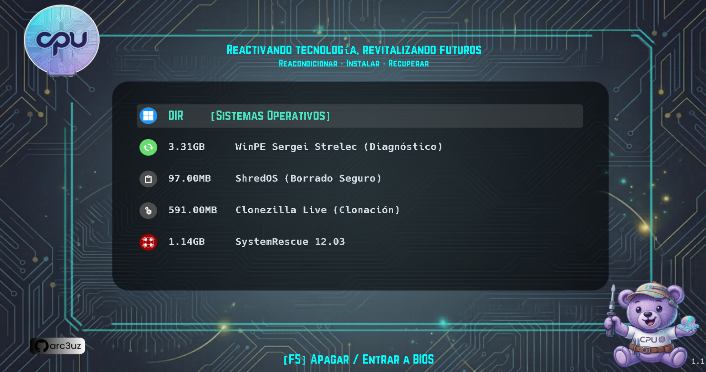

# CPU UC - Ventoy Theme 💻🌱


Este repositorio contiene la configuración visual y técnica para los pendrives de diagnóstico y despliegue de la iniciativa **CPU UC**. El objetivo es estandarizar el proceso de reacondicionamiento de hardware donado, garantizando privacidad, calidad y eficiencia técnica.

---

## 🚀 Vista Previa


---

## 🛠️ Estructura del Pendrive
Para que el archivo `ventoy.json` automatice correctamente los nombres e iconos, el pendrive debe mantener la siguiente jerarquía en su partición de datos:

```text
/
├── ISO/
│   ├── 1- Sistemas Operativos/
│   │   ├── Linux/             # ISOs de Zorin, Mint, Arch, Fedora
│   │   └── Windows/           # ISOs de Windows 10/11 LTSC
│   ├── 1_WinPE11_10_Sergei_Strelec_...iso
│   ├── 3_shredos-...iso
│   ├── 4_Clonezilla_...iso
│   └── 5_SystemRescue_...iso
└── ventoy/
    ├── ventoy.json            # Configuración de lógica y alias
    └── theme/
        └── CPU_UC/            # Activos visuales y tipografías
```

## 📋 Flujo de Trabajo Operativo (SOP)
El menú está diseñado para guiar al voluntario de forma secuencial y lógica durante el proceso de reacondicionamiento:

1. **Diagnóstico (WinPE Sergei Strelec):** Primer paso obligatorio. Permite realizar un inventario técnico (HWiNFO), verificar la salud de los discos duros (CrystalDiskInfo) y realizar pruebas de estrés térmico (AIDA64/OCCT).
2. **Borrado Seguro (ShredOS):** Garantiza la confidencialidad de la información. Este paso realiza una sanitización irreversible de los datos del donante original siguiendo estándares internacionales.
3. **Despliegue de OS:** Una vez validado el hardware, se procede a la instalación de Windows 10/11 LTSC para uso institucional o distribuciones Linux (Zorin/Mint) para maximizar la vida útil en equipos de bajos recursos.

---

## 🧰 Herramientas Integradas y Recursos
Este tema ha sido optimizado para trabajar con las siguientes herramientas técnicas. Se incluyen enlaces a su documentación oficial para facilitar el soporte técnico y la actualización de los archivos ISO:

### 🛠️ Diagnóstico Principal: [WinPE Sergei Strelec](https://sergeistrelec.name/)
Es el pilar del flujo de trabajo de **CPU UC**. El tema incluye iconos y alias específicos para esta suite.
* **Uso en el taller:** Inventariado rápido con **HWiNFO**, validación de salud de discos con **CrystalDiskInfo** y pruebas de estabilidad con **AIDA64** o el **Diagnóstico de memoria de Windows** integrado.
* **Nota técnica:** Al usar Strelec en modo UEFI, evitamos los problemas de compatibilidad que presentan las versiones antiguas de MemTest86 sueltas, consolidando el diagnóstico en un solo entorno gráfico.

### 🧹 Privacidad: [ShredOS](https://github.com/PartialVolume/shredos.x86_64)
Identificado automáticamente por el tema para asegurar que el borrado de datos sea el centro del proceso.
* **Uso en el taller:** Sanitización irreversible de discos mediante el algoritmo `nwipe`, cumpliendo con el protocolo de privacidad para los equipos donados.

### 💾 Motor de Booteo: [Ventoy](https://www.ventoy.net/)
La base técnica de este proyecto. Este repositorio actúa como un "plugin" visual y lógico sobre Ventoy.
* **Documentación:** [Ventoy News & Docs](https://www.ventoy.net/en/doc_news.html) para entender el funcionamiento del archivo `ventoy.json` y la estructura de carpetas.

### 🌐 Sistemas Operativos de Reacondicionamiento
El tema incluye soporte visual para las siguientes distribuciones recomendadas por la iniciativa:
* **[Zorin OS Education](https://zorin.com/os/education/):** Software educativo para contextos escolares.
* **[Linux Mint XFCE](https://linuxmint.com/):** Fluidez máxima para hardware antiguo.
* **[Windows LTSC](https://learn.microsoft.com/en-us/windows/whats-new/ltsc/):** Versión empresarial de Windows sin bloatware para máxima estabilidad.

---

## 🔧 Guía de Personalización

### Cómo asignar nuevos iconos
Para vincular una ISO nueva con un icono específico y mantener la estética del tema:
1. Agrega el icono en formato `.png` (preferiblemente de 48x48 o 64x64 píxeles) en la carpeta `/ventoy/theme/CPU_UC/icons/`.
2. En el archivo `ventoy.json`, busca la sección `menu_class` y añade una nueva línea siguiendo este formato:
   `{ "key": "PalabraClave", "class": "nombre_del_icono" }`
   *Donde **key** es una palabra que identifica a la ISO y **class** es el nombre del archivo de imagen sin la extensión .png.*

### Ajustes Visuales
Si necesitas realizar ajustes finos en la interfaz (posiciones, colores o dimensiones):
- Edita el archivo `/ventoy/theme/CPU_UC/theme.txt`.
- **Posición del menú:** Busca las variables `left`, `top`, `width` y `height`.
- **Fuentes:** El tema utiliza **Hack** para una legibilidad técnica óptima y **Norwester** para mantener la identidad visual de la iniciativa.

---

## ⚙️ Instalación Rápida
1. Instala **Ventoy** en tu unidad USB.
2. Descarga este repositorio.
3. Copia la carpeta `ventoy` de este repo directamente a la raíz de tu pendrive.
4. En la carpeta `ISO` en la raíz del pendrive y organiza tus archivos según la nomenclatura especificada en la sección de estructura para que los alias y tips se apliquen automáticamente.

---

## ⚖️ Licencia
Este proyecto se distribuye bajo la licencia **GNU GPL v3**. Eres libre de usarlo, estudiarlo y modificarlo, siempre que cualquier versión derivada mantenga esta misma licencia y reconozca la autoría original de la iniciativa.

---
**Desarrollado por arc3uz para la iniciativa estudiantil CPU UC.**
